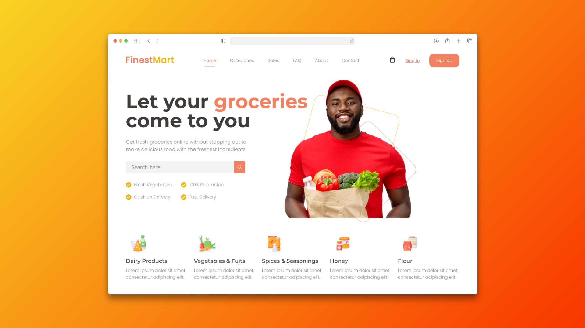

# FinestMart Web Landing Page

Bienvenido a **FinestMart**, una landing page moderna diseñada para un supermercado online, desarrollada para practicar y mejorar habilidades en **HTML**, **CSS** y arquitectura **SCSS**. Este proyecto simula la página principal de una tienda de comestibles, resaltando servicios clave y beneficios para el usuario.

## 🚀 Características

- Diseño moderno, visual y responsivo.
- Paleta de colores atractiva y elementos visuales personalizados.
- Secciones dedicadas a categorías de productos: Lácteos, vegetales y frutas, especias, miel y harina.
- Buscador integrado para facilitar la experiencia del usuario.
- Menú de navegación con enlaces a categorías, ventas, preguntas frecuentes, contacto y autenticación.

## 🛠️ Tecnologías utilizadas

- **HTML5** para la estructura semántica.
- **CSS3** para estilos responsivos.
- **Sass (SCSS)** para una arquitectura modular y mantenible de los estilos.

## 📚 Propósito del proyecto

Este sitio web fue desarrollado para practicar diseño web y perfeccionar el dominio de **HTML**, **CSS** y **SCSS**, enfocándose en la creación de interfaces atractivas, funcionales y escalables para proyectos de e-commerce.

---

**¡Gracias por visitar este proyecto! Espero que te inspire a seguir aprendiendo y experimentando con desarrollo web moderno.**
